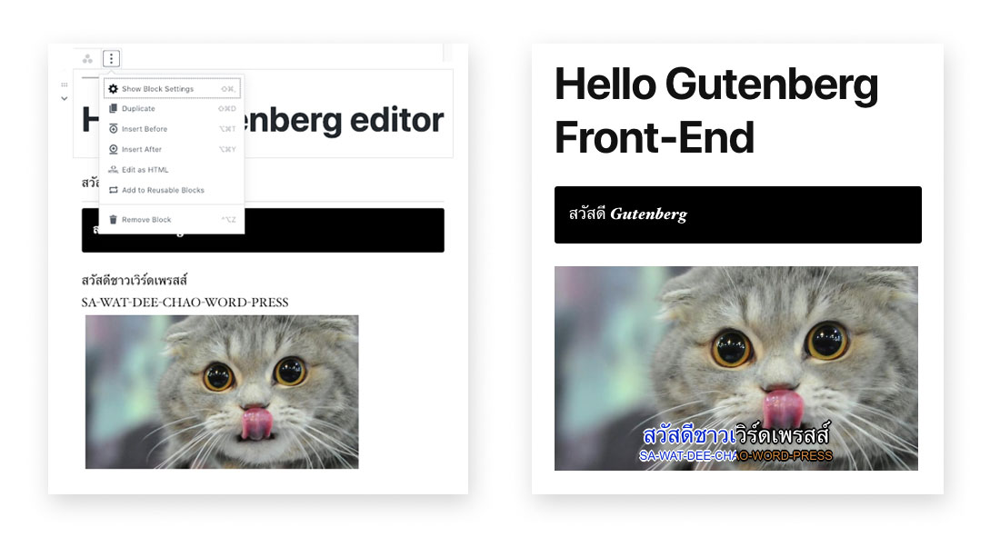

# Getting Started Gutenberg Block 

This project use for workshop __WordCamp Bangkok 2019__

## Installation

- You can download and copy each folder to `/wp-content/plugins` in your WordPress Project.
- Go to __Plugins__ click __Activate__.
- Create a new __Post__ and let's try the blocks!